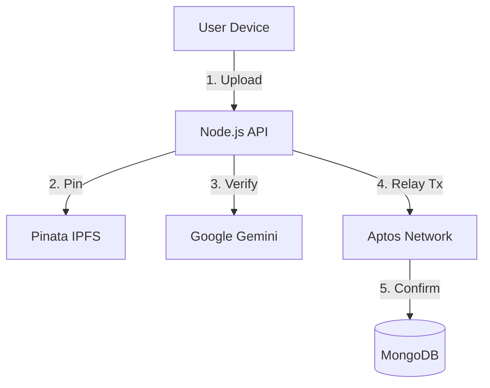

# 🌐 LifeVault: The Complete Ecosystem Documentation

**Version:** 2.0.0
**Status:** Beta (Testnet Live)
**Core Stack:** Aptos Blockchain, IPFS, Node.js, React, Android (Kotlin)

---

## 📑 Table of Contents

1. **Executive Summary & Vision** ("The Why")
2. **Business Strategy & MVP** ("The What")
3. **Technical Architecture** ("The How")
4. **Component Deep Dive**
5. **Detailed Folder Structure**
6. **Key Technical Workflows**
7. **Future Roadmap**

---

## 1. Executive Summary & Vision

**LifeVault** is a **Decentralized Memory Preservation & Gamification Protocol**. It bridges the gap between digital permanence and real-world engagement.

### The Problems Solved

* **Digital Fragility:** In Web2, if you stop paying your cloud subscription or get banned, your memories are deleted. LifeVault uses **IPFS** (InterPlanetary File System) for decentralized storage and **Aptos** for immutable ownership, ensuring memories survive independently of any single entity.
* **Passive Engagement:** Traditional storage apps are static archives. LifeVault introduces **"Proof of Experience"**, a gamified layer where users must physically visit locations and capture moments to unlock rewards, transforming memory capture into an RPG.
* **Crypto Complexity:** LifeVault abstracts away blockchain friction (wallets, gas fees) using a backend "Relayer," making Web3 invisible to the end-user.

---

## 2. Business Strategy & MVP

The platform operates as a **B2B2C (Business-to-Business-to-Consumer)** marketplace connecting Explorers (Users) with Experience Creators (Brands).

### 2.1 The Minimum Viable Product (MVP)

The current codebase implements two distinct sides of the platform:

**A. For Users ("The Explorer")**

* **Immutable Vault:** Upload photos/videos that are encrypted and pinned to IPFS forever.
* **Quest Map:** View and participate in location-based challenges (e.g., "Visit the Eiffel Tower").
* **AI Verification:** Get instant feedback on quest submissions via Google Gemini AI, which checks for location accuracy and anti-spoofing (no screen photos).

**B. For Business ("The Creator")**

* **Campaign Dashboard:** Brands create "Quests" to drive foot traffic to physical locations.
* **Reward Pools:** Brands fund campaigns with APT, which is automatically distributed to users upon successful quest completion.

### 2.2 Revenue Model

1. **Quest-as-a-Service (Primary):** Brands pay a SaaS fee + a per-verification fee to host campaigns that drive verifiable physical visits.
2. **Freemium Storage:** Users get 5GB free; Premium users pay for unlimited decentralized pinning and inheritance features.
3. **Institutional Archival:** Governments/Universities issuing soulbound credentials (diplomas, deeds) on LifeVault.

---

## 3. Technical Architecture

The system utilizes a **Hybrid Web3 Architecture**. It combines the speed of a centralized API for metadata/search with the trustlessness of blockchain for ownership.



### Core Tech Stack

* **Blockchain:** Aptos (Move Language) for asset ownership and transfer logic.
* **Backend:** Node.js (Express) acting as an orchestrator and gas station.
* **Storage:** Pinata (IPFS) for media; MongoDB for metadata and user profiles.
* **AI:** Google Gemini 1.5 Flash for computer vision and anti-spoofing.
* **Frontend:** React (Vite) + Tailwind for the web dashboard.
* **Mobile:** Native Android (Kotlin) for the physical capture interface.

---

## 4. Component Deep Dive

### 🏛️ A. The Blockchain Layer (Aptos Move)

**File:** `backEnd/move/sources/MemoryVault.move`
The smart contract acts as the "Source of Truth" for ownership.

* **`struct Memory`**: The core asset containing `ipfs_hash`, `owner`, and `timestamp`.
* **`store_memory`**: The primary entry point. It mints the memory to the user's account.
* **`transfer_memory`**: Enables the **Inheritance Protocol**, allowing assets to be moved to a beneficiary wallet.
* **`UserMemories`**: An on-chain index tracking which IDs belong to which address.

### 🧠 B. The Intelligence Layer (Node.js)

**File:** `backEnd/src/services/`

* **Gas Relayer (`aptosService.js`)**: Implements `submitSponsoredMemory`. It verifies a user's off-chain signature and submits the transaction via the backend's master wallet, paying the gas fee on behalf of the user.
* **AI Vision Guard (`aiVisionService.js`)**: Sends images to Gemini with a strict system prompt: *"Anti-Spoofing Checks: Detect if this is a photo of a screen... respond with JSON."*.

### 💻 C. The Web Platform (Journey Builder)

**File:** `lifevault-journey-builder/src/`

* **Story Engine**: Users can bundle individual memories into "Chapters" or "Time Capsules" (`CreateStoryModal.tsx`).
* **Business Portal**: A dedicated interface for brands to track campaign analytics and user engagement (`BusinessDashboard.tsx`).

### 📱 D. The Mobile Frontier (Android)

**File:** `LifeVault-dapp/app/src/`

* **Manual TX Building**: The app manually constructs BCS (Binary Canonical Serialization) payloads and signs them using a local Ed25519 `CryptoManager`, bypassing the need for external wallet apps.
* **Hardware Integration**: Uses CameraX and ML Kit for QR scanning and wallet pairing.

---

## 5. Detailed Folder Structure

### 📂 Root: `backEnd` (API & Smart Contracts)

The central nervous system handling logic, AI, and blockchain syncing.

```text
backEnd/
├── move/                               # APTOS SMART CONTRACTS
│   ├── Move.toml                       # Package config & addresses
│   └── sources/
│       └── MemoryVault.move            # CORE LOGIC: Memory structs & ownership
├── src/                                # NODE.JS SOURCE
│   ├── config/
│   │   ├── constants.js                # Game rules (XP values, Quest Types)
│   │   └── database.js                 # MongoDB connection
│   ├── controllers/                    # BUSINESS LOGIC
│   │   ├── authController.js           # JWT & Wallet auth
│   │   ├── questController.js          # GPS & AI verification flow
│   │   ├── memoryController.js         # IPFS pinning & DB sync
│   │   └── campaignController.js       # Brand campaign management
│   ├── middleware/
│   │   ├── authMiddleware.js           # JWT protection
│   │   └── utilityMiddleware.js        # Logging & Rate limiting
│   ├── models/                         # MONGODB SCHEMAS
│   │   ├── User.js                     # Profile, RPG Stats, Wallet Info
│   │   ├── Memory.js                   # IPFS Hash <-> Metadata link
│   │   ├── Quest.js                    # Location targets & AI prompts
│   │   └── Story.js                    # Collections of memories
│   ├── routes/                         # API ENDPOINTS
│   │   ├── authRoutes.js               # /api/auth
│   │   ├── questRoutes.js              # /api/quests
│   │   └── memoryRoutes.js             # /api/memories
│   ├── services/                       # EXTERNAL SERVICES
│   │   ├── aiVisionService.js          # GEMINI: Anti-spoofing logic
│   │   ├── aptosService.js             # BLOCKCHAIN: Gas Relayer
│   │   ├── ipfsService.js              # PINATA: File storage
│   │   └── geolocationService.js       # GPS distance calc
│   └── app.js                          # Express App setup
└── package.json                        # Dependencies (@aptos-labs/ts-sdk)

```

### 📂 Root: `lifevault-journey-builder` (Web Dashboard)

The user-facing "Command Center" for managing digital legacies.

```text
lifevault-journey-builder/
├── src/
│   ├── components/
│   │   ├── dashboard/                  # APP UI
│   │   │   ├── Timeline.tsx            # Memory feed
│   │   │   ├── StatsCards.tsx          # Storage/XP display
│   │   │   └── AddMemoryModal.tsx      # Upload interface
│   │   ├── story/                      # STORY MODE
│   │   │   └── CreateStoryModal.tsx    # Memory bundling UI
│   │   ├── wallet/                     # WEB3 CONNECT
│   │   │   └── WalletSelector.tsx      # Petra/Martian adapter
│   ├── context/
│   │   ├── AuthContext.tsx             # User session state
│   │   └── WalletContext.tsx           # Aptos connection state
│   ├── hooks/
│   │   └── useMemories.ts              # Data fetching hook
│   ├── pages/                          # ROUTING
│   │   ├── Dashboard.tsx               # Main user landing
│   │   ├── Campaigns.tsx               # Quest Map & Discovery
│   │   ├── BusinessDashboard.tsx       # Brand Portal
│   │   └── QuestMap.tsx                # Leaflet map integration
│   ├── services/                       # API CLIENTS
│   │   ├── api.ts                      # Axios instance
│   │   └── questApi.ts                 # Quest endpoints
│   └── App.tsx                         # Router config

```

### 📂 Root: `LifeVault-dapp` (Android Mobile)

The native app for physical world interaction and capture.

```text
LifeVault-dapp/app/src/main/
├── AndroidManifest.xml                 # Permissions (Camera, Internet)
├── java/com/codebyte/lifevault_dapp/
│   ├── core/                           # LOW-LEVEL LOGIC
│   │   ├── AptosClient.kt              # Manual RPC Client & TX Builder
│   │   ├── CryptoManager.kt            # Ed25519 Key Gen
│   │   └── IPFSClient.kt               # Mobile Uploads
│   ├── data/                           # DATA LAYER
│   │   ├── MemoryRepository.kt         # Local caching
│   │   └── BackendApiService.kt        # Retrofit API
│   ├── ui/                             # JETPACK COMPOSE
│   │   ├── components/
│   │   │   ├── QRScanner.kt            # CameraX Scanner
│   │   │   └── WalletBalanceCard.kt    # UI Component
│   │   ├── screens/
│   │   │   ├── HomeScreen.kt           # Main Dashboard
│   │   │   └── UnlockScreen.kt         # Biometric Auth
│   └── MainViewModel.kt                # UI State Holder

```

---

## 6. Key Technical Workflows

### 6.1 The "Gasless" Memory Creation

This workflow allows users to mint NFTs without holding APT cryptocurrency.

1. **Upload:** User uploads a file via the frontend. `ipfsService.js` pins it to Pinata and returns an IPFS Hash.
2. **Sign:** The user's wallet *signs* the IPFS Hash string (off-chain operation).
3. **Relay:** The backend receives `{ ipfsHash, signature, publicKey }`.
4. **Verify & Mint:** `aptosService.js` verifies the signature. If valid, the **Master Account** builds and submits a `store_memory` transaction to Aptos, paying the gas fees.
5. **Result:** The user owns the on-chain asset, but the platform paid the cost.

### 6.2 The AI Quest Verification Loop

1. **Capture:** Mobile app captures a photo at specific GPS coordinates.
2. **Geo-Check:** Backend validates the user is within 50m of the target using `geolocationService.js`.
3. **AI-Check:** `aiVisionService.js` sends the image to Google Gemini.
* *Prompt:* "Verify if this is [Target Location]. Check for screen spoofing."


4. **Reward:** If `passed: true`, the backend updates `User.questStats` and optionally triggers an on-chain reward transfer.

---

## 7. Future Roadmap

* **Phase 1 (Legacy Protocol):** Implementation of a "Dead Man's Switch" that auto-transfers the `MemoryVault` to a beneficiary if the user is inactive for a set period (supported by `transfer_memory` in Move contract).
* **Phase 2 (Hardware "Twin-Lock"):** Integration of NFC tags at physical locations, requiring users to "tap" their phone *and* take a photo for 2-factor location verification.
* **Phase 3 (Decentralized AI):** Migrating computer vision tasks from Google Gemini to a decentralized compute network (like Render or Akash) to remove the centralized AI dependency.
