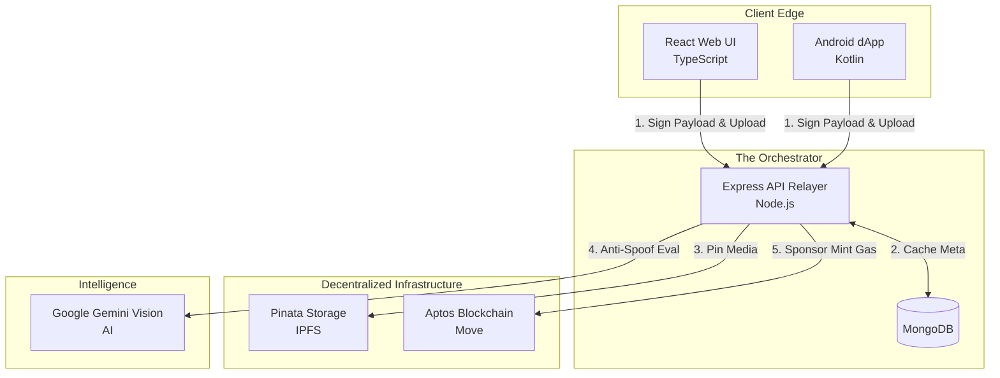

# 🌐 LifeVault: The Complete Ecosystem Documentation

[](https://explorer.aptoslabs.com/)
[](https://react.dev/)
[](https://nodejs.org/)
[](https://developer.android.com/)
[](https://ai.google.dev/)

**Version:** 2.0.0 | **Status:** Beta (Testnet Live)

LifeVault is a **Decentralized Memory Preservation & Gamification Protocol**. It bridges digital permanence, cryptographic asset ownership, and real-world physical engagement using a customized hybrid Web3 architecture.

---

## 🔗 Live Links & Deployments

* 🏛️ **Smart Contract (Aptos Explorer):** [View LifeVaultV2 Module on Devnet](https://explorer.aptoslabs.com/account/0x599c19cd1f5a85d4eb4f403337bee2c26a8259b43c6cd0c9b6cdfd63d3874cc6/modules?network=devnet)
* 🌐 **Journey Builder (Frontend):** *https://life-vault-frontend-evuq.vercel.app/*
* ⚙️ **API Gateway (Backend):** *https://life-vault-backend.vercel.app/*
* 📱 **Android dApp:** Available in :[releases](https://github.com/Normie69K/LifeVault-dapp/releases/tag/v1.0)

---

## 📑 Table of Contents

1. [Executive Summary & Vision](#1-executive-summary--vision)
2. [Business Strategy & MVP](#2-business-strategy--mvp)
3. [Technical Architecture & Language Mapping](#3-technical-architecture--language-mapping)
4. [Component Deep Dive](#4-component-deep-dive)
5. [Detailed Folder Structure](#5-detailed-folder-structure)
6. [Key Technical Workflows](#6-key-technical-workflows)
7. [Future Roadmap](#7-future-roadmap)
8. [LICENSE](#8-LICENSE)

---

## 1. Executive Summary & Vision

**The Vision:** To build an unalterable, gamified ledger for human experiences.

### 🛑 The Problems Solved (Concise)
1.  **Digital Fragility:** Web2 clouds delete inactive data. **Solution:** IPFS pinning for media permanence + Aptos blockchain for mathematically proven asset ownership.
2.  **Passive Archiving:** Storage apps are boring. **Solution:** "Proof of Experience" logic requiring users to travel physically to locations to unlock NFT rewards.
3.  **Web3 Friction:** Mass adoption is killed by gas fees. **Solution:** A backend "Gas Relayer" that pays transaction fees on behalf of the Web2 user.

---

## 2. Business Strategy & MVP

LifeVault is a **B2B2C marketplace** matching Everyday Explorers with Experience Creators (Brands).

### 🎯 The Minimum Viable Product (MVP)
* **For Users ("Explorers"):** An Android app and Web Portal to upload decentralized memories, bundle them into timelines, and complete location-based Quests.
* **For Brands ("Creators"):** A SaaS dashboard to fund location-based campaigns (e.g., "Visit our new cafe") and distribute automated rewards via smart contracts.
* **The AI Judge:** Google Gemini Vision acts as the untamperable referee, proving users actually visited locations without spoofing (e.g., taking photos of computer screens).

### 💰 Revenue Model
1.  **B2B Quest-as-a-Service:** Brands pay a SaaS deployment fee + micro-transactions for verified foot traffic.
2.  **B2C Freemium Storage:** Users get 5GB free; Premium unlocks unlimited IPFS pinning and smart contract "Inheritance" features.

---

## 3. Technical Architecture & Language Mapping

The system combines the fast read speeds of a NoSQL Web2 database with the trustless, zero-downtime execution of the Web3 Aptos blockchain.

### 💻 Language & Tech Stack Mapping
* **Smart Contracts:** `Aptos Move` (Rust-inspired, strictly-typed language preventing double-spend exploits).
* **Backend Orchestrator:** `JavaScript / Node.js (Express)` (Handles high-speed API requests, IPFS syncing, and AI processing).
* **Frontend Web:** `TypeScript / React (Vite)` (Ensures type-safe component rendering for the complex business dashboard).
* **Native Mobile:** `Kotlin / Jetpack Compose` (Direct access to hardware-level Android Keystore for secure signing without external wallets).



---

## 4. Component Deep Dive

### 🏛️ 1. The Blockchain Layer (`/lifeVault-smartContracts`)

Written in **Aptos Move**, this is the ultimate Source of Truth.

* **Core Logic:** The `lifevault.move` module defines the `Memory` asset. Because Move uses "resources", these memories cannot be implicitly discarded or duplicated.
* **Key Functions:** `mint_memory` (creates the asset) and `transfer_memory` (allows inheritance/gifting).

### ⚙️ 2. The Intelligence & Relay API (`/lifeVault-backEnd`)

Written in **Node.js/Express**, it eliminates friction.

* **Gas Relayer:** Validates off-chain user signatures, wraps them in a transaction payload, and submits them using the Master Backend Wallet, absorbing the Aptos gas fee.
* **AI Vision Guard:** Streams real-time physical images to Google Gemini to prevent fraud (detecting monitors, printed paper, or deepfakes).

### 🌐 3. The Journey Builder (`/lifeVault-frontEnd`)

Written in **React (TypeScript) & Vite**, tailored for desktop management.

* **Story Engine:** Lets users bundle isolated IPFS hashes into chronological "Chapters".
* **Creator Portal:** Provides brands with analytics and UI controls to fund smart-contract reward pools.

### 📱 4. The Physical Edge (`/lifeVault-dApp`)

Written in **Kotlin (Android)**, utilizing hardware.

* **Non-Custodial Cryptography:** Uses Android's native Keystore to generate Ed25519 keypairs. The private key never touches the internet.
* **Sensors:** Binds CameraX and Geolocation directly into the Web3 uploading flow.

---

## 5. Detailed Folder Structure

```text
LifeVault_Innova8/
│
├── lifeVault-smartContracts/               # 🏛️ THE BLOCKCHAIN LAYER (Move)
│   ├── Move.toml                           # Package manifest & network addresses
│   └── sources/lifevault.move              # Core asset ownership rules
│
├── lifeVault-backEnd/                      # ⚙️ THE ORCHESTRATOR (Node.js)
│   ├── src/models/                         # MongoDB schemas (User, Quest, Memory)
│   ├── src/controllers/                    # REST API route logic
│   └── src/services/                       # Integrations
│       ├── aiVisionService.js              # Gemini Anti-Spoofing
│       ├── aptosService.js                 # Gas Relayer & SDK
│       └── ipfsService.js                  # Pinata IPFS pinning
│
├── lifeVault-frontEnd/                     # 🌐 THE WEB PLATFORM (React/TS)
│   ├── src/pages/                          # Routing (Dashboard, QuestMap, Login)
│   ├── src/components/                     # Reusable shadcn/ui components
│   └── src/context/                        # Auth & Aptos Wallet connection state
│
└── lifeVault-dApp/                         # 📱 THE NATIVE EDGE (Kotlin)
    ├── app/src/main/java/core/             # Web3 RPC wrappers & CryptoManager
    ├── app/src/main/java/data/             # Local database & API Retrofit config
    └── app/src/main/java/ui/               # Jetpack Compose UI screens

```

---

## 6. Key Technical Workflows

### 6.1 The "Gasless" Minting Workflow

How Web2 users mint NFTs without buying crypto:

1. **Upload:** User uploads a photo via the app. Backend `ipfsService.js` pins it and returns an `ipfs://` hash.
2. **Sign Offline:** The user's device (`CryptoManager.kt`) signs the hash string.
3. **Relay:** Backend receives the signature. `aptosService.js` validates it.
4. **Mint & Sponsor:** The Backend's Master Wallet constructs the `mint_memory` payload, pays the gas, and routes ownership to the user's address.

### 6.2 The AI "Proof-of-Experience" Loop

How Quests prevent cheating:

1. **Capture:** User takes a photo inside a geofenced area.
2. **Geo-Validation:** Backend validates GPS coordinates are within 50m of the target.
3. **Vision Evaluation:** `aiVisionService.js` prompts Gemini: *"Verify this image is physically at [Landmark]. Return false if a digital screen or printed photo is detected."*
4. **Reward:** If true, the smart contract automatically drops $APT or NFT Badges into the user's wallet.

---

## 7. Future Roadmap

* **Phase 1: The Inheritance Protocol (Dead Man's Switch)**
Expanding the Move contract. If a wallet has zero transactions for 5 years, an oracle auto-transfers the `MemoryVault` to a predefined cryptographic beneficiary.
* **Phase 2: Hardware "Twin-Lock" Verification**
Deploying NFC tags at physical landmarks. Users must cryptographically "tap" their Android device *and* pass the Gemini visual check for 2-Factor Physical Authentication.
* **Phase 3: Decentralized AI Migration**
Replacing Google Gemini with decentralized compute networks (like Akash or Render) to execute open-source visual Anti-Spoofing models, fully decentralizing the intelligence layer.

---

## 8. License

This project is licensed under the **MIT License**. 

You are free to use, copy, modify, merge, publish, distribute, sublicense, and/or sell copies of the software, provided that the original copyright notice and this permission notice are included in all copies or substantial portions of the software. 

See the [LICENSE](LICENSE)
